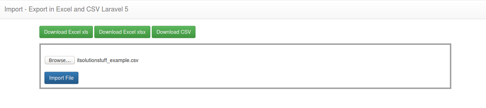

## apredendo relatorio
- sudo apt-get install php7.2-zip
- rodar  - key:generate (php artisan key:generate
)

### Laravel 5 import export to excel and csv using maatwebsite example.
- https://itsolutionstuff.com/post/laravel-5-import-export-to-excel-and-csv-using-maatwebsite-exampleexample.html
- https://itsolutionstuff.com/post/laravel-56-import-export-to-excel-and-csv-exampleexample.html
- https://www.webslesson.info/2018/05/how-to-export-mysql-data-to-excel-file-in-laravel.html

- https://youtu.be/US0Eg6mbjmo
- https://www.youtube.com/watch?v=rWjj9Slg1og

 ``
 .env

BUGSNAG_API_KEY=3b822baaf752174bee85d7cbf129cd31

DB_CONNECTION=pgsql
DB_HOST=127.0.0.1
DB_PORT=5432
DB_DATABASE=contato_lumen
DB_USERNAME=postgres
DB_PASSWORD=postgres

``
composer require maatwebsite/excel
composer require "maatwebsite/excel":"~2.1.0"

- "maatwebsite/excel": "~2.1.0"
- 
providers' => [
 ....

 Maatwebsite\Excel\ExcelServiceProvider::class,

],

'aliases' => [

 ....

 'Excel' => Maatwebsite\Excel\Facades\Excel::class,

],

******************************
ou
***********************
'providers' => [

    ....

    'Maatwebsite\Excel\ExcelServiceProvider',

],

'aliases' => [

    ....

    'Excel' => 'Maatwebsite\Excel\Facades\Excel',

],

- Config

- If you are using Laravel 5 then fire following command:

- php artisan vendor:publish

- If you are using Laravel 4 then fire following command:

- php artisan config:publish maatwebsite/excel

- Model 
- php artisan make:migration create_items_table
- php artisan make:migration create_tbl_customer_table

- correçoes
- php artisan config:clear
- php artisan config:cache

## Observers
- https://www.schoolofnet.com/canal-direto-ao-ponto/laravel-eventos-observers/
- php artisan event:generate
- php artisan make:auth
- parei em 14min./////////